# 1 - Getting Started


Load the data that we will use.


```matlab:Code
I = imread('lab1/images/napoleon.png');
Il = imread('lab1/images/napoleon_light.png');
Id = imread('lab1/images/napoleon_dark.png');
Z = imread('lab1/images/zebra.png');
```

# 2 - Viewing Images and Saving Images


Below is one of the example images we will work on.


```matlab:Code
imtool(I);
```


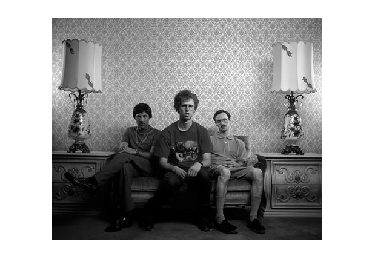

# 2 - Image Tool

```matlab:Code
imtool(I);
```


# Q1 - Pixel Value


Print out value. We see that it is of type UINT-8 and 


```matlab:Code
I(1, 1)         % It prints out 89
```


```text:Output
ans = 89
```

# 3 - Contrast, Brightness and Datatypes


Plot all three different example images. Regular, light and dark.


```matlab:Code
imtool(I);
imtool(Il);
```


```matlab:Code
imtool(Id);
```


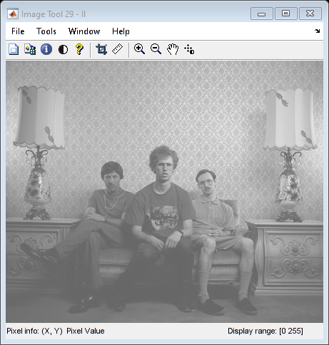


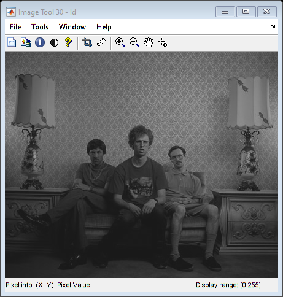

# Q2 - Histograms


From figure 1, which is the regular image, we see that the pixel values are spread across the domain . The second figure is skewed towards the lighter pixel values and this image should be the high contrast one. The third histogram shows the third image and how it is skewed in the other direction and is thus the histogram of the low contrast image.


```matlab:Code
figure(1);
imhist(I);
```


```matlab:Code

figure(2);
imhist(Il);
```


```matlab:Code

figure(3);
imhist(Id);
```


# See images

```matlab:Code
Is = single(I);
imtool(I);
imtool(Is);
```


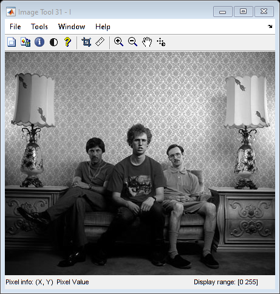


```matlab:Code
imtool(Is/255);
```


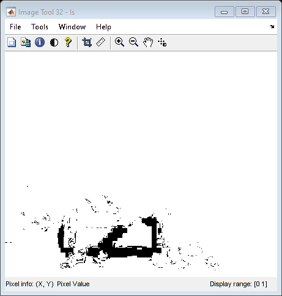


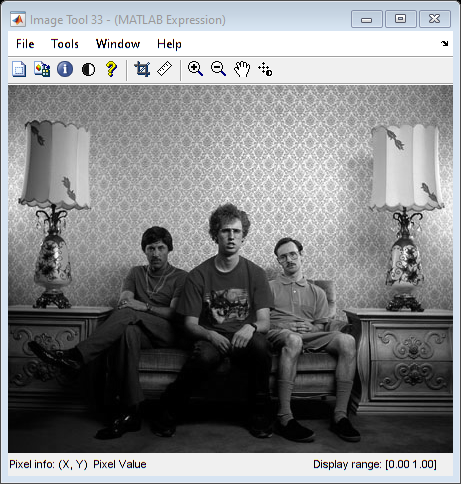

# Q3 - Explain differences

```matlab:Code
figure(1);
imtool((I/64)*64);

figure(2);
imtool((Is/64)*64);
```


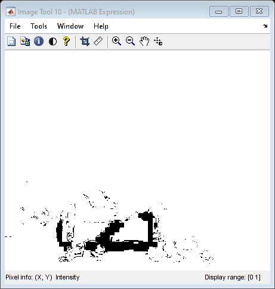


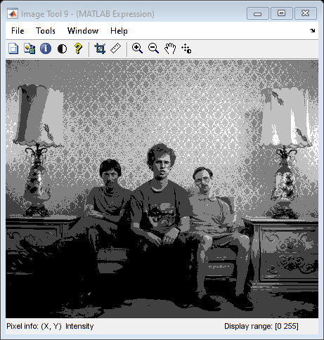

# Q4 - Make images brighter

```matlab:Code
imtool(I + 50);
imtool(I);
```


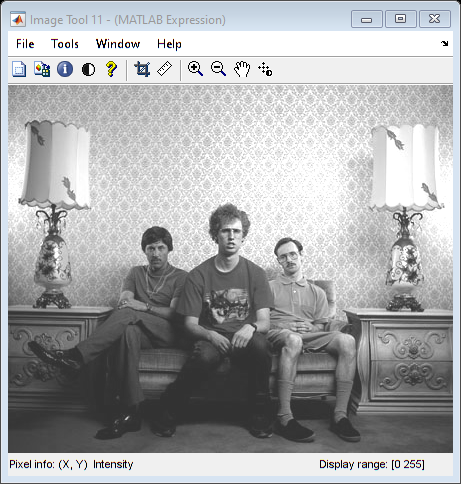

# Q5 - Make images lower contrast

```matlab:Code
imtool(I);
imtool(I * 0.5);
```


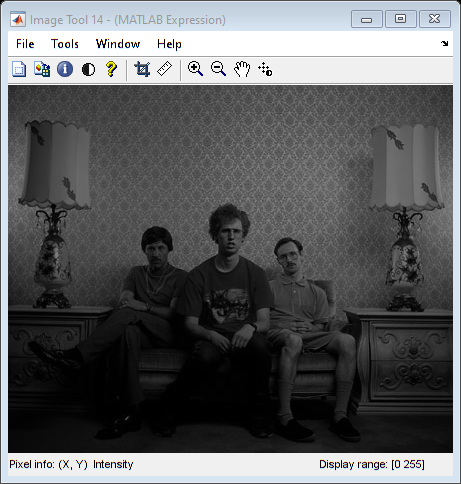


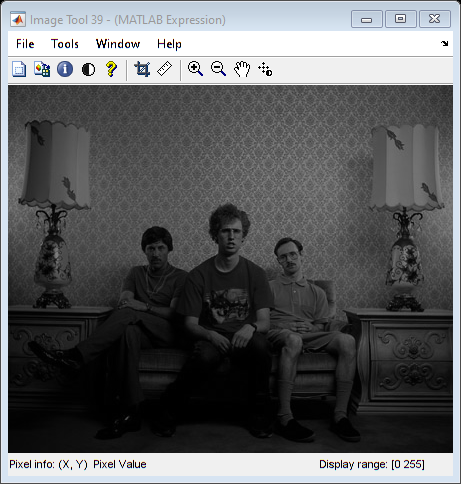

# Q6 - Pixel Wise Transforms

```matlab:Code
figure(1);
imhist(I);

figure(2);
imshow(I);
```


```matlab:Code

g = 0.5;
L = double(I).^g;
out = uint8(L .* (255/max(max(L))));

figure(3);
imhist(out);

figure(4);
imshow(out);
```


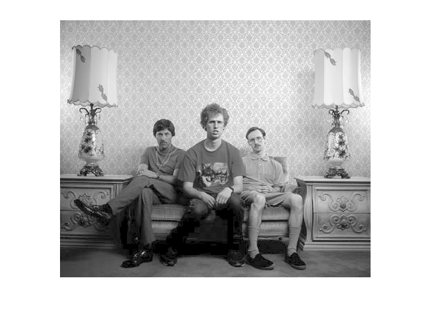


```matlab:Code

g = 2;
L = double(I).^g;
out = uint8(L .* (255/max(max(L))));

figure(5)
imhist(out);
```


```matlab:Code

figure(6);
imshow(out);
```


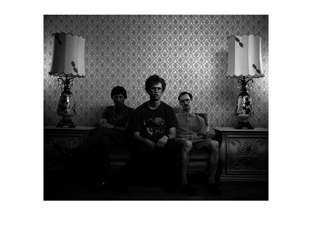

# Q7 - Histogram Equalization napoleon - Histogram

```matlab:Code
figure(1);
imhist(I);
```


```matlab:Code

figure(2);
imhist(histeq(I));
```


```matlab:Code

figure(3);
imhist(histeq(Il));
```


```matlab:Code

figure(4);
imhist(histeq(Id));
```


# Q7 - Histogram Equalization napoleon - Images

```matlab:Code
figure(1);
imshow(I);

figure(2);
imshow(histeq(I));

figure(3);
```


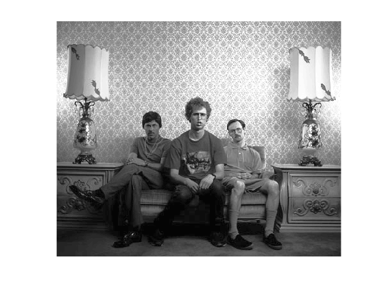


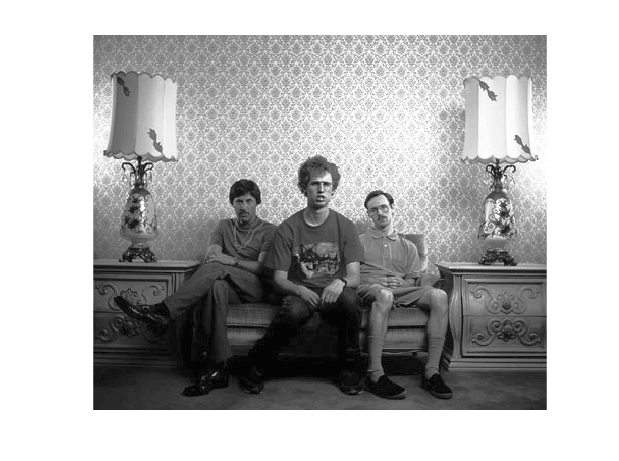


```matlab:Code
imshow(histeq(Il));
```


```matlab:Code

figure(4);
imshow(histeq(Id));
```


# Q7 - Histogram, transform and cumulative histogram - Regular Image

```matlab:Code
[J,T] = histeq(I);

figure
plot((0:255)/255,T);
```


```matlab:Code

figure
plot(cumsum(imhist(I)) / sum(imhist(I)));
```


```matlab:Code

figure
plot(cumsum(imhist(J)) / sum(imhist(J)));
```


# Q7 - Histogram, transform and cumulative histogram - Light

```matlab:Code
[J,T] = histeq(Il);

figure
plot((0:255)/255,T);
```


```matlab:Code

figure
plot(cumsum(imhist(Il)) / sum(imhist(Il)));
```


```matlab:Code

figure
plot(cumsum(imhist(J)) / sum(imhist(J)));
```


# Q7 - Histogram, transform and cumulative histogram - Dark

```matlab:Code
[J,T] = histeq(Id);

figure
plot((0:255)/255,T);
```


```matlab:Code

figure
plot(cumsum(imhist(Id)) / sum(imhist(Id)));
```


```matlab:Code

figure
plot(cumsum(imhist(J)) / sum(imhist(J)));
```


# Q8 - Aliasing when sampling

```matlab:Code
Jnf = imresize(I, [78 78], 'nearest', 'antialiasing', false);
imshow(Jnf);
```


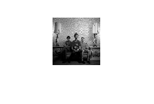


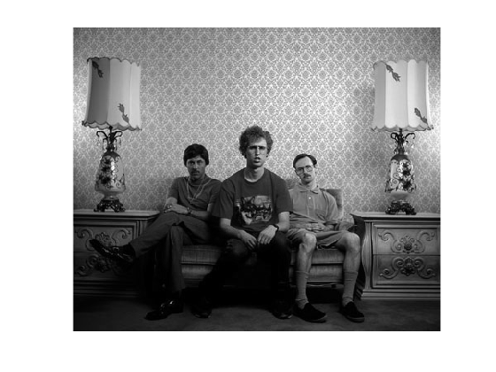

